# Kinodel IDE

### Bring an idea. Choose the vibe. Direct your crew.

**Kinodel is an open-source runtime-vibe-factory for creators.** A node-based creative workspace where an idea can grow into a story, a cast, a sequence of images, a film — and, later, a world worth returning to.

Imagine a lone astronaut running a flower shop on a rainy moon. Give the crew your premise, a character reference and a visual mood. Develop the story with Storytell. Find the face and place with Wardrobe. Stage the shots with Storyboard. Set them in motion with Filmmaker. Keep what works. Ask for another take where it doesn't.

**You hold the taste and the final say. The crew brings the craft.**

```text
Human directs.       Agents create.
Graph coordinates.   Tools render.
Artifacts remember.  Chunks carry the magic forward.
```

> **Building the foundation.** The contracts and local Python stack are ready for implementation; the node workspace and production application are not shipped. Cinematic is the first build target. Music, serials and reusable creative memory are the next chapters.

## Your production desk

The workspace is a readable sequence of **nodes**, not one endless chat. Each node has a job, visible inputs and a result you can inspect. Open it to see instructions, versions, references, discussion and generation progress.

- **Follow the work:** see what is ready, rendering or waiting for your decision.
- **Talk to the specialist:** “keep the silhouette, soften the lighting” goes to the owner of that result.
- **Choose deliberately:** a question explains; an edit makes a new version; approval moves production forward.
- **Keep the takes:** v1, v2 and v3 remain part of the history rather than overwriting each other.
- **Return to the project:** durable execution is designed to survive a closed browser and a restarted application.

First: a fixed, useful production route. Later: configurable nodes, a sequential composer and visual groups when the workspace needs them. [Node contract →](docs/backend/node.md)

## Meet the crew

| Specialist | What they bring to the table | Scope |
|---|---|---|
| [Storytell](docs/agents/storytell.md) | Premise, story beats, a reason to watch the next shot | Cinematic MVP |
| [Wardrobe](docs/agents/wardrobe.md) | Character appearance, visual anchors and a coherent world to shoot in | Cinematic MVP |
| [Storyboard](docs/agents/storyboard.md) | Composition, staging and image plans for each shot | Cinematic MVP |
| [Filmmaker](docs/agents/filmmaker.md) | Motion, camera intent and video plans that start from selected frames | Cinematic MVP |
| [Muse](docs/agents/muse.md) | Musical direction, original song concepts and sound-led production | Later |
| [Season](docs/agents/season.md) / [Episode](docs/agents/episode.md) | Long arcs, episode stories and continuity across a series | Later |
| [Critic](docs/agents/critic.md) | Optional observations and suggestions for the author to choose from | Later |
| [Producer](docs/agents/producer.md) | Optional help shaping a brief before production | Later |

The crew does not manage its own graph. Each agent has a bounded task and an owned output. **[Render](docs/tools/render.md) is a tool service, not an LLM persona.** MVP [Montage](docs/tools/montage.md) is deterministic assembly with ffmpeg; creative editing comes later. Concise system instructions live in [`.agents/`](.agents/README.md), separately from developer contracts.

## Pipelines: different ways to make something

### Cinematic · first build

```mermaid
flowchart LR
    B["Your brief"] --> S["Storytell<br/>writes the story"]
    S --> SH{"You review<br/>the story"}
    SH -->|revise| S
    SH -->|approve| W["Wardrobe<br/>designs anchors"]

    W --> AG["anchor-gen<br/>renders characters & places"]
    AG --> AH{"You choose<br/>visual anchors"}
    AH -->|revise| W
    AH -->|approve| SB["Storyboard<br/>plans every shot"]

    SB --> FG["frames-gen<br/>renders shot images"]
    FG --> FH{"You choose<br/>story frames"}
    FH -->|revise| SB
    FH -->|approve| F["Filmmaker<br/>plans motion"]

    F --> VG["video-gen<br/>renders video takes"]
    VG --> VH{"You choose<br/>shot videos"}
    VH -->|revise| F
    VH -->|approve| M["Montage<br/>assembles in story order"]
    M --> FINAL["Final video"]
```



The rectangles make or generate something. The diamonds are yours. Nothing crosses a diamond until your decision is durably saved.

## Fork

Fork позволяет попробовать другое продолжение с выбранного этапа, сохранив исходный вариант. Дерево образуют executions одного проекта; схема pipeline от этого не меняется.

```text
Run A: Brief → Story → Anchors → Storyboard → Frames → Filmmaker → Videos → Final A
                            └─ Fork B: Storyboard → Frames → Filmmaker → Videos → Final B
                                                       └─ Fork C: Filmmaker → Videos → Final C
```

## Human-in-the-loop: authorship, not a confirmation popup

At every review node you see one exact version and the material behind it. Four actions have deliberately different meanings:

| Your action | What Kinodel does |
|---|---|
| **Approve** | Locks your decision to the displayed version and lets the next node use it |
| **Revise** | Sends your note to that result's specialist; text returns as a new version, media returns through its planner and generation tool |
| **Ask** | The specialist explains the current result; no new version is created and production remains paused |
| **Cancel** | Stops the run durably; late model or render results cannot revive it |

For example, “why is this shot so wide?” is a question. “Make it intimate, keep the red coat” is a revision for Storyboard. The new frame set becomes v2, while v1 remains inspectable. Approving v1 never approves v2, and typing “looks good” in chat never presses the approval button.

This separation matters because generation may take minutes and the browser may close. The decision, target version and pending work survive independently. A render finishing is only a candidate result; taste remains with the creator.

The first route produces a silent film from approved clips in story order. It has no mandatory Producer, Critic or final-memory gate. [Exact cinematic route →](docs/pipelines/cinematic.md) · [Human actions →](docs/hilp/hilp.md)

### Next chapters · design directions, not shipped routes

| Pipeline | Creative journey |
|---|---|
| [Music video](docs/pipelines/music-video.md) | Muse → original music → timed visuals → audio-led montage |
| [Serial season](docs/pipelines/serial.md) | Characters and premise → season spine → episode plans and continuity |
| [Serial episode](docs/pipelines/serial.md) | Approved season + previous ending → episode story → images and video → updated continuity |

These earlier proposals will be reconciled with current node and HITL contracts when activated. Cinematic is a starting point, not the boundary of Kinodel.

## Chunks: keep the character, not the whole conversation

A **creative chunk** is a compact, approved piece of reusable production memory with its sources and selected media. It carries what another production needs to know — not the prompts, retries and logs that happened along the way.

| Memory | What travels forward |
|---|---|
| **Character** | Identity, appearance, traits, visual references and what must not drift |
| **Cinema** | A completed film's visual language, selected moments and reusable lessons |
| **Music** | Musical inspiration, approved audio references and permitted use |
| **Season** | World rules, character arcs, episode promises and shared continuity |
| **Episode** | Planned intent or completed events, ending state and unresolved threads — clearly distinguished |
| **Music video** | The completed relationship between song, timing and images |

Think: the same astronaut in a new short, with the same face and coat, but a different day. Or episode three remembering the promise made in episode two.

Chunk creation and publication are later capabilities. A [memory feature](docs/tools/memory.md) prepares selected source fields and creator-authored claims for review; the author approves what becomes reusable truth. Saving does not require a Craft agent. Finishing a film does not silently publish a summary or change your personal taste. [Chunk contracts →](docs/rag/chunks.md)

## Context: give each specialist the right material

The planned context picker makes references explicit: `@file`, `@@chunk`, `@@character`. A selected source has a role — canon, continuity, inspiration or evidence — and a particular receiving node.

```text
Your selected references ─┐
Approved upstream work ──┼→ bounded context → one specialist → one result
Agent craft guidance ────┘
```

Wardrobe needs the character's appearance. Storytell needs narrative constraints. Filmmaker needs the selected frame and motion intent. None of them needs the entire project chat.

A Markdown wiki holds sourced knowledge; chunks hold approved creative memory; agent resources hold craft instructions. They are different things. Exact versions are pinned, mandatory material is not silently dropped, and private references are not automatically injected into every project. Search starts with direct selection; broader discovery comes only when the library needs it. [Context architecture →](docs/context/context.md)

## Under the hood

```text
Node workspace → FastAPI commands → LangGraph
                                      ├─ agent calls → validated artifacts
                                      ├─ human waits → explicit decisions
                                      └─ tools → background generation / montage

SQLite + managed files preserve the work.
Checkpoints preserve where execution paused.
```

**Local baseline:** CPython **3.13.15**, LangGraph, Pydantic v2, FastAPI/Uvicorn, SQLite and ffmpeg. Local work needs no account; signing in does not upload the project. Remote generation receives selected authorized inputs, not the whole library.

Tools submit durable generation jobs and return promptly. The model does not sit waiting for a GPU. Provider adapters own payloads and transport; creative plans remain provider-neutral. PostgreSQL and hosted identity/storage are a separate deployment track.

## A small frontend, organised around the workspace

Start with the workspace, its canvas/inspector/viewer components and a typed HTTP client. Extract shared UI or feature modules when real reuse warrants it. The frontend displays results and submits commands; the Python backend owns execution. [Frontend boundaries →](docs/frontend/webui.md)

## Find your way around

```text
docs/agents/       the crew's contracts
.agents/           concise application system prompts and future micro-contexts
docs/pipelines/    creative production routes
docs/backend/      how execution, nodes, results and local storage work
docs/hilp/        human decisions, discussion and future execution forks
docs/context/     references and per-agent context
docs/rag/         reusable chunks, wiki and later discovery
docs/frontend/    the creator's workspace
skills/           local framework references
.reference/       upstream source for research
legacy/           the old prototype, read-only evidence
```

[Documentation map](docs/README.md) · [Build plan](docs/roadmap-mvp.md) · [Product roadmap](docs/roadmap.md) · [Product soul](SOUL.md)

## Development status

The Windows x64 baseline passes dependency checks, real HTTP validation and a SQLite-backed LangGraph pause/resume across separate processes. This is a **stack smoke check**, not a completed production flow, provider test or crash-recovery certification.

To install the verified Windows x64 lock in a new environment with CPython 3.13.15 installed (do not recreate an existing working environment):

```powershell
py -3.13 -m venv .venv313
.\.venv313\Scripts\python.exe -m pip install -r requirements-win-py313.lock
.\.venv313\Scripts\python.exe -m pip check
.\.venv313\Scripts\python.exe -m unittest discover -s tests -v
```

Step 0 is verified on Windows: all 46 runtime pins reproduce in a clean venv. `backend/config.py` selects an absolute data root outside the checkout and venv without creating files: `%LOCALAPPDATA%\Kinodel`, or Linux `${XDG_DATA_HOME:-$HOME/.local/share}/kinodel`, with explicit `KINODEL_DATA_ROOT` override. Linux installation is not yet verified.

The workspace interpreter default is `.venv313`; select it manually if your IDE already remembers another environment. `scripts/test.ps1` verifies the interpreter and runs the same unittest command above. The retained test covers data-root selection and validation; the earlier HTTP/pause-resume smoke check has no retained script yet. Next: storage and text contracts, then restart-safe Storytell → human revision → resume. See [step 0 evidence](docs/roadmap-mvp.md#шаг-0-подготовка-репозитория-и-окружения).

**Make something worth keeping. Keep enough to make the next thing better.**

License: Apache-2.0.
